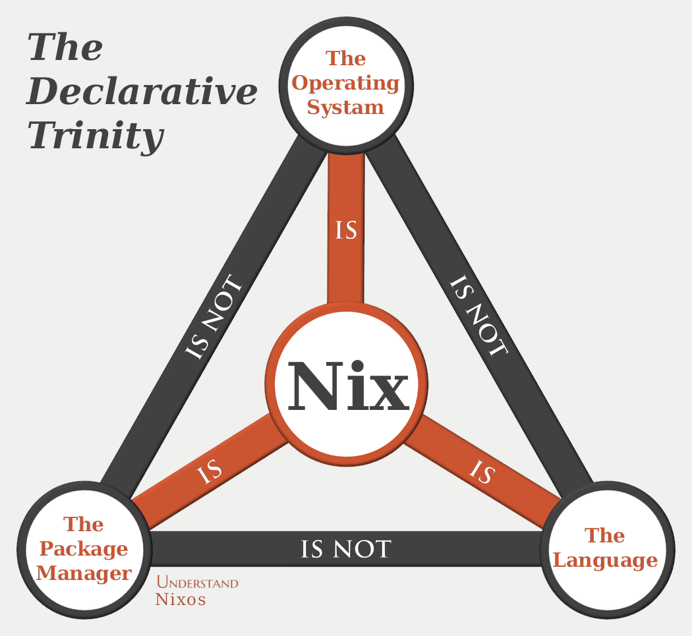

# Notes

Things of interest related to this configuration and adjacent projects

{: style="height:400px;border-radius:4px;"}

## Utilities

- [NixOS Search](<https://search.nixos.org/packages>): The main place to find packages and NixOS related options
- [Home Manager Options](<https://nix-community.github.io/home-manager/options.xhtml>): Home Manager options
- [Noogle](https://noogle.dev/): Function search and documentation
- [PR Tracker](https://nixpkgs-tracker.ocfox.me/): Check whether a PR has been merged to each of the Nixpkgs branches. [Alternative](<https://nixpk.gs/pr-tracker.html>)
